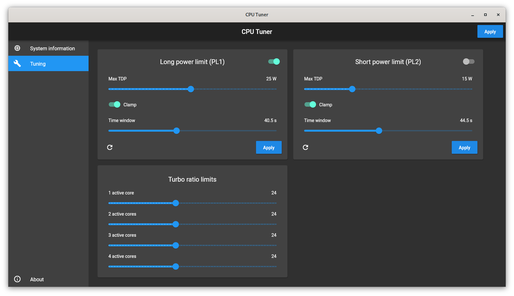

# cpu_tuner

A graphical Linux application for overclocking Intel CPUs.

## Preparation

### Enable the msr kernel module
You can either do `modprobe msr` or if you want it permanently enabled you can 
create the file `/etc/modules-load.d/msr.conf` containing the 
word `msr` on the first line and then reboot.

This is needed because only code running at Ring 0 protection level (the kernel
space) can modify the model-specific registers. No userspace program can have 
access to these register without passing through the kernel.

### Install msr-tools
`pacman -S msr-tools` if you are on Arch Linux. This installs the `rdmsr` and 
`wrmsr` binaries used to communicate with the kernel module.

## Compilation

1) Run `flutter build linux` (with `--debug` for debug mode).
2) Run `cargo build` (with `--release` for release mode) inside `cpu_tuner_rs/` 
to build the shared library.
3) Copy the shared library from `cpu_tuner_rs/target/[debug|release]/libcpu_tuner.so` 
to `build/linux/[debug|release]/bundle/`.
4) Run the executable as root.

Optionally, `strip` all the shared libraries inside the bundle to greatly reduce their size. 
I don't know why neither Flutter nor Rust strip the binaries when compiling in release mode.

## Screenshots

#### I am not responsible for any damage caused by this tool. Use it at your own risk.